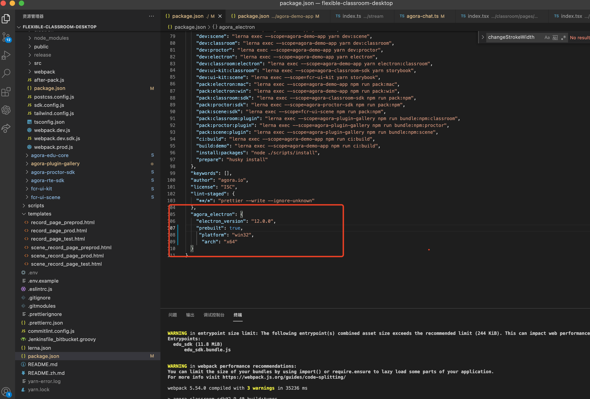
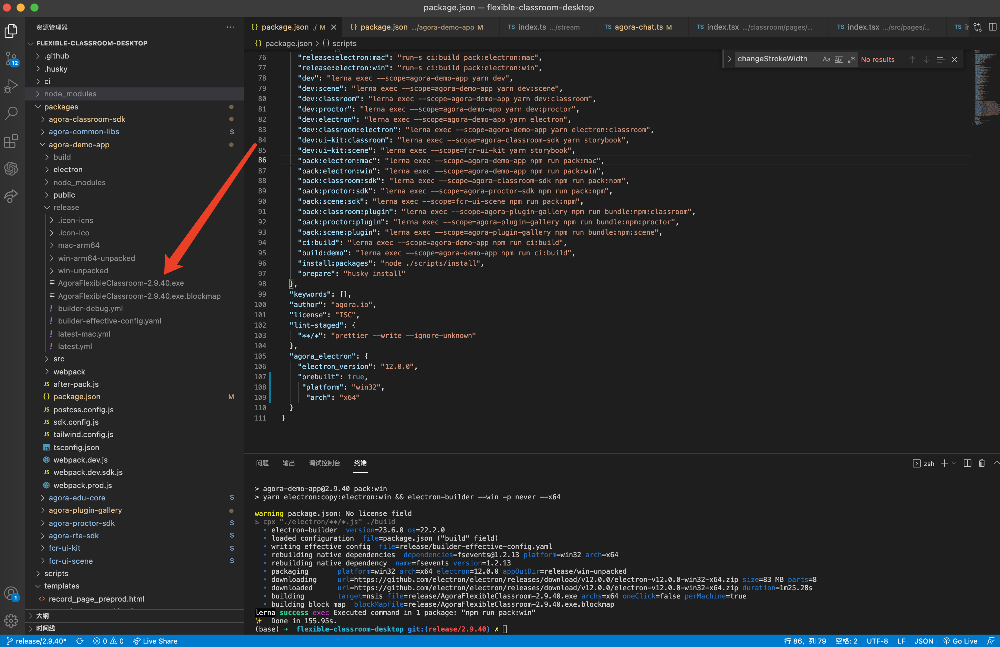

export const toc = [{}];

To create a Smart Classroom Windows installation package using a Mac, take the following steps:

1. Delete `agora-electron-sdk` in the `node_modules` folder.

2. Add the following code to the `package.json` file:

    ```json
    "agora_electron": {
      "electron_version": "12.0.0",
      "prebuilt": true,
      "platform": "win32",
      "arch": "x64"
    }
    ```

    

3. Modify the `pack:win` command in the `packages/agora-demo-app/package.json` file and add the `arch` parameter at the end to specify the system architecture, such as the 64-bit operating system architecture:

    ```json
    "pack:win": "yarn electron:copy:electron:win && electron-builder --win -p never --x64",
    ```

    If you need to package for a 32-bit operating system, change the last parameter to `--ia32`.

4. Run the installation command again:

    ```bash
    yarn install
    ```

5. Run the following commands to package Smart Classroom:

    ```bash
    yarn pack:classroom:sdk
    yarn pack:classroom:plugin
    yarn ci:build
    yarn pack:electron:win
    ```

6. The packaging process is complete. You can find the generated installation package in the `packages/agora-demo-app/release` directory.

    
