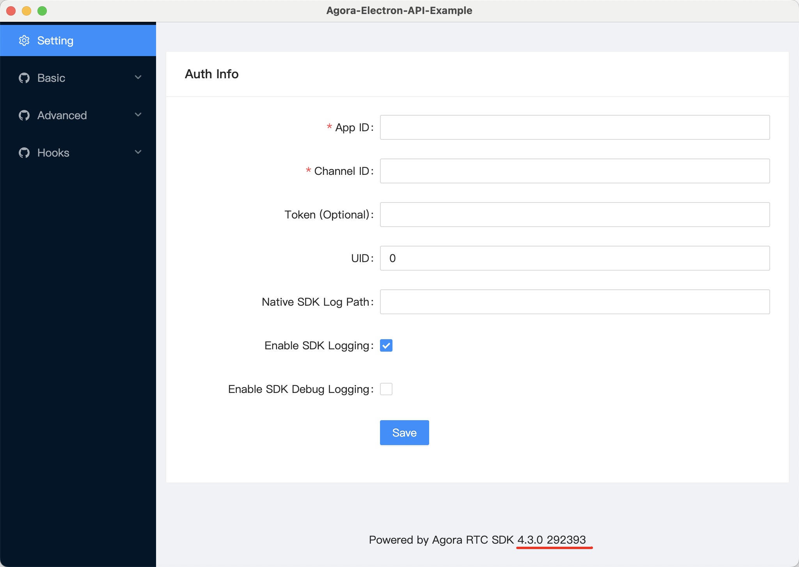
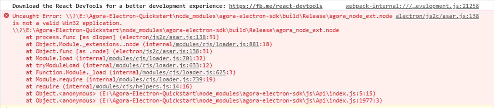
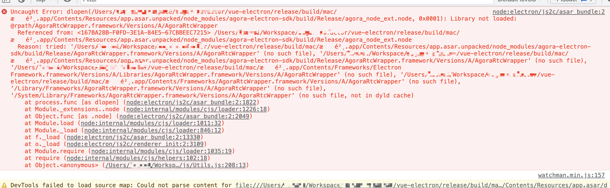

## Introduction

This page describes the problems and solutions that may encounter during the integration SDK phase, compile and run phase, and packaging phase of developing an Electron app.

## Implementation

### Integrate SDK stage

#### npm install downloads slowly or times out

Error message: **code ETIMEDOUT**

This is usually a network or proxy problem, try any of the following solutions:

    - Set mirror source

        `https://registry.npmjs.org/` is the original official npm mirror download address which is slow for domestic users. Switching to a reliable mirror source in mainland China can improve the download speed, take the Taobao npm mirror source as an example:

            ``` shell
            # Set npm's mirror source to Taobao source
            npm config set registry https://registry.npmmirror.com/
            # Set npm's Electron mirror source as a Taobao mirror source
            npm config set ELECTRON_MIRROR https://npmmirror.com/mirrors/electron/
            ```

    - Set up the proxy correctly

        If you are using a network proxy, you need to make sure that the proxy settings for the command line tool are correct:

            ``` shell
            # View Global Proxy Address
            npm config get proxy
            # Set the global proxy (HTTP proxy address)
            npm config set proxy http://<proxy-server-address>:<port-number>
            # Set the global proxy (HTTPS proxy address)
            npm config set proxy https://<proxy-server-address>:<port-number>
            ```

        Usually, the proxy tool provides the function of a one-click copy command to set the terminal proxy.

<PlatformWrapper platform="windows">
    - Modify environment variables

        Right click on **Computer > Properties > Advanced System Settings > Environment Variables**. Create the following variables under user variables:

        | variable name   | variable  |
        | --------------- | --------- |
        | ELECTRON_MIRROR | `https://npmmirror.com/mirrors/electron/` |

        Once the setup is complete, reopen a command line tool and run `npm install` to install the dependencies.
</PlatformWrapper>
<PlatformWrapper platform="macos">
    - Modify environment variables

        Run the following command in a terminal to modify the environment variables:

            ``` shell
            export ELECTRON_MIRROR='https://npmmirror.com/mirrors/electron/'
            export ELECTRON_GET_USE_PROXY=true
            ```

        Environment variables modified using the above method will only take effect in the current terminal. If you want environment variables to take effect permanently, you need to configure the above parameters into `.zshrc` or `.bashrc`.
</PlatformWrapper>

#### Error installing dependencies with `cnpm` and `yarn`

In this case, Agora recommends that you first refer to the method in **npm install downloads slowly or times out** section above, use npm native commands to set the mirror source and proxy address, and then install the dependencies.

You can also refer to the following commands to set up the proxy and mirror source for yarn:

    ``` shell
    # Set up a proxy
    yarn config set proxy <proxy-server-address>:<port-number>
    yarn config set https-proxy <proxy-server-address>:<port-number>

    # Set the mirror source
    yarn config set registry https://registry.npmmirror.com/
    yarn config set ELECTRON_MIRROR https://npmmirror.com/mirrors/electron/
    ```

#### Too many levels of symbolic links

Error message: **Too many levels of symbolic links error**

The error indicates that there are too many layers of symbolic links (also called soft links) in the project, and there may be circular dependencies that prevent the library from being installed.

Use the following command to prevent symbolic links from being created when installing npm packages:

    ``` shell
    npm install --no-bin-links
    ```

#### How to identify the correspondence between Electron SDK version number and Native SDK version number?

    - Judging from the release notes: The **SDK version number** listed in the release notes is identical to the **Native version number**.

    - Obtain from the Demo: The version number of Native SDK is shown directly at the bottom of the Electron Demo as shown in the figure:

        

### Compile and run phase

#### Running prompts for non-32-bit applications



Error message: **agora_node_ext.node is not a valid Win32 application**

By default, **npm** will download the native module of the corresponding architecture based on the current computer architecture when installing dependencies.

The current error means that the wrong architecture was downloaded during the dependency download, resulting in the application not being able to start, and suggesting that a 32-bit `agora_node_ext.node` is required.

You can try any of the following methods to fix the issue:

    - Using npm environment variables

        You can create a new `.npmrc` file directly in the root directory of your project and write the following to configure the **npm environment variables**:

            ``` npm
            agora_electron_sdk_arch = ia32
            arch=ia32
            ```

        After saving the configuration, you need to reinstall `agora-electron-sdk` and try to package it again.

    - Manually configure "agora_electron" in `package.json`

    "agora_electron" can be configured with the following fields:

        - (Optional) `platform`: The default is selected according to the system, e.g., `macOS`: **darwin**, Windows: **win32**.
        - (Optional) `prebuilt`: Set to `true` by default to prevent compatibility issues with Electron or Node.js versions that are incompatible with the SDK.
        - (Optional) `arch`: Selected by default according to the system architecture.

        For example, if you want to package a 32-bit application on a Windows 64-bit computer, you need to configure `package.json` as follows:

            ``` json
            "agora_electron":{
              "platform":"win32",
              "arch":"ia32"
              }
            ```

    After saving the configuration, you need to reinstall `agora-electron-sdk` and try to package it again.

#### Unable to get the application window, resulting in an inability to share the screen

When you encounter the problem that the application window cannot be obtained through `getScreenWindowsInfo` which prevents you from sharing the screen, you can refer to the following steps to troubleshoot:

    1. Confirm whether the API call is correct

    You can refer to the following documentation to check if the screen sharing-related API calls are correct:

        - [Electron screen sharing Demo source code](https://github.com/AgoraIO-Extensions/Electron-SDK/blob/main/example/src/renderer/examples/advanced/ScreenShare/ScreenShare.tsx)

    1. Check for authorization

    Check the [Electron official website documentation](https://www.electronjs.org/docs/latest/api/system-preferences#systempreferencesgetmediaaccessstatusmediatype-windows-macos) to make sure that screen sharing permissions have been authorized.

    1. Contact an Agora engineer to troubleshoot

    If the first two steps still did not troubleshoot the problem, please [contact Agora technical support](https://www.agora.io/en/customer-support).

### Packaging stage

#### Packaging crashes



If you encounter the above problems, please check the following in order:

    1. Check if the file in the error message exists. The figure shows that `AgoraRtcwrapper` cannot be found.

    1. Check if `webpack.config` is configured correctly.

        Make sure that the syntax of the `webpack.config` file is correct and matches the requirements of your project. You can refer to the [official webpack documentation](https://webpack.js.org/concepts/).

    1. Check if the `asar.unpacked` configuration is correct.

       The `asar.unpacked` configuration is used to specify which files should be unpacked into the application package. You can refer to the [configuration in the Demo](https://github.com/AgoraIO-Extensions/Electron-SDK/blob/main/example/package.json#L20), or check the [Electron official documentation](https://www.electron.build/configuration/configuration#configuration-asarUnpack).

    1. Ensure that your project's dependency on the SDK is `require`.

       On macOS, `import` statements can cause some symbol conflict issues that can lead to packaging failures, which can be avoided with `require` statements. Projects using the Vue framework have a high probability of packaging failure.

       ``` typescript
       import createAgoraRtcEngine from 'agora-electron-sdk';
       /// import changed to require
       const createAgoraRtcEngine = require("agora-electron-sdk");
       ```

#### Errors related to application authorization

Error message: **com.apple.security.app-sandbox of null**

This error indicates an `app-sandbox` exception. `app-sandbox` is a security mechanism that restricts an application's access to system resources.

If you don't need to publish your app to the App Store, you can remove `com.apple.security.app-sandbox` from the `.entitlements` file; otherwise, check that the `.entitlements` file is configured correctly to ensure that there are no syntax and naming errors.

#### Incorrect configuration of `asar.unpacked`

Error message: **Uncaught SyntaxError:Error parsing**

This error is usually caused when the configuration of `asar.unpacked` is incorrect, which is used to specify which files should be unpacked into the application package.
You can refer to the [configuration in the Demo](https://github.com/AgoraIO-Extensions/Electron-SDK/blob/main/example/package.json#L20), or check the [official Electron documentation](https://www.electron.build/configuration/configuration#configuration-asarUnpack).

#### Unable to resolve library or module

- Error 1：`failed to compile, can't resolve agora-electron-sdk`

- Error 2：`failed to compile, can't resolve agora_node_ext`

- Error 3：`cannot find module`

The above error indicates that the library could not be parsed or the module could not be found. This error is usually caused by incorrect configuration of the compilation tool. Please refer to the following methods to solve the problem:

    1. If your project uses Vue, make sure that the project depends on the SDK as `require`, not `import`.

    ``` typescript
    import createAgoraRtcEngine from 'agora-electron-sdk';
    /// modify import to require
    const createAgoraRtcEngine = require("agora-electron-sdk");
    ```

    1. Modify tool configuration

    Depending on the language you are using and the compilation tool, refer to the following pages for configuration:

        - **Vue**：https://nklayman.github.io/vue-cli-plugin-electron-builder/
        - **Vite**：https://electron-vite.github.io/
        - **React**：https://github.com/electron-react-boilerplate/electron-react-boilerplate
        - **Webpack**：https://webpack.electron.build/
