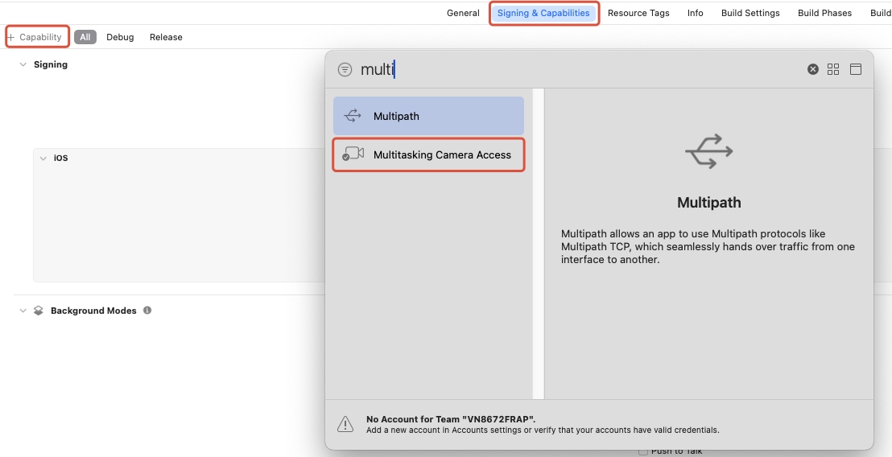

Starting with iOS 16, the system allows apps to continue accessing the camera in multitasking mode. This means that camera capture can continue in layouts such as split view, slide over, and picture-in-picture.

From v4.6.2 onwards, RTC SDK supports this system capability. It requires enabling the **multitasking-camera-access** permission through the official API. This guide describes how to enable multitasking camera capture on iOS.

## Prerequisites

- An Apple Developer account enrolled in the Apple Developer Program (paid)
- Your app supports iOS 16 or iPadOS 16 and above

## Enable multitasking camera access

1. Log in to the [Apple Developer Console](https://developer.apple.com/account/).

2. On the **Identifiers** page, select the App ID for which you want to enable multitasking camera access.

3. On the App ID's configuration page, enable the **Multitasking Camera Access** option, save the changes, and regenerate your provisioning profile.

    The entitlement key for this permission is `com.apple.developer.avfoundation.multitasking-camera-access`, which indicates that the app can access the camera in multitasking scenarios.

4. In Xcode, open your project, select the corresponding target, go to the **Signing & Capabilities** page, click the **+ Capability** button, and add **Multitasking Camera Access**.

    

## App submission and review

After completing feature development:

- Build the app using the corresponding provisioning profile.
- When submitting to the App Store for review, include an explanation in the app review notes about why your app requires the multitasking camera permission. Apple's review may focus on whether there is a clear business need for this permission.
