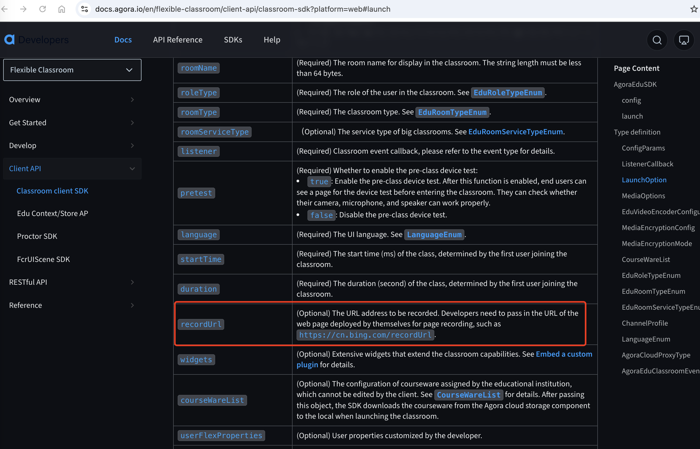

export const toc = [{}];

If recording fails, take the following steps to troubleshoot the problem:

1. Refer to [Configure classroom storage and recording](/flexible-classroom/get-started/enable-flexible-classroom#configure-classroom-storage-and-recording) to check whether the recording-related configuration is correct, including:

    - If `recordingConfig` is not set, the default configuration is used.
    - If `storageConfig` is configured correctly, especially the vendor, region, and endpoint fields are correct and match. For example, if the third-party cloud storage service you use is located in Shanghai, then the application server where you initiate the request must also be located in Shanghai.

    ```shell
    "vendor": 2,
    "region": 1, //CN_Shanghai
    endpoint:https://agora-recording.oss-cn-shanghai.aliyuncs.com
    ```

1. If the above configurations are correct but recording still fails, check whether the public read permission of the third-party cloud storage account you are using is enabled.

1. If the recording configuration is correct and public read permission is enabled, but the recording still fails, debug the specific error cause in the local browser by concatenating the recorded URL of the page:

    1. Get the value of `recordUrl` passed in as a parameter in the Web-side `LaunchOption` call.

       

    1. Call the [RESTful API for querying the recording list](/flexible-classroom/restful-api/classroom-api#get-the-recording-list) and obtain URL2 from the  `webRecordUrlQuery` response parameter.

    1. Concatenate URL1 and URL2, to get a complete URL of the page recording. You can access it locally with a browser for debugging. If you can opened the URL, then the recording has started successfully; if not, find the reason based on the error report.
