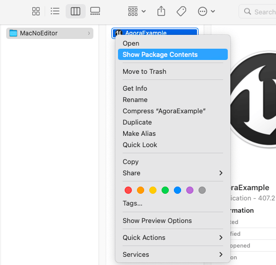

export const toc = [{}];

In order to implement real-time interactive features on different target platforms, you need to add camera, microphone, and other permissions to your Unreal Engine project. Depending on the target platform, you can refer to this article for steps and configurations to get these permissions.

## iOS

If the target platform is iOS, in the **Unreal Editor**, click **Edit > Project Settings > Platforms > iOS** to package the project and paste the following code into the **Additional Plist Data** input box to add the camera and microphone permissions required for real-time interaction:

    ``` xml
    <key>NSCameraUsageDescription</key><string>AgoraVideoCall</string><key>NSMicrophoneUsageDescription</key><string>AgoraVideoCall</string>
    ```

## macOS

If the target platform is macOS, refer to the following steps to add the camera and microphone permissions required for real-time interaction to your Unreal Engine project:

### Step 1: Modify the **Info.plist** file

    For Unreal Engine 4, you can directly modify the **Info.plist** file generated after the project is packaged to add the required permissions to your project. If you are using Unreal Engine 5, Agora suggests that you modify the **Info.plist** template that comes with the engine to ensure that the required permissions have been added to the file that is generated during packaging.

#### Unreal Engine 4

    In the **Unreal Editor**, click **Edit > Project Settings > Platforms > Mac** Package Project. Right-click on the compiled application file (`.app`) and select **Show Package Contents** to display the package contents, which includes the files generated by the package **Info.plist**.

    

#### Unreal Engine 5

    Open `./Epic Games/<Unreal Engine version path>/Engine/Source/Runtime/Launch/Resources/Mac` which is the local path where the **Info.plist** template is located.

### Step 2: Add privacy permissions

    Add the following camera and microphone privacy permissions to the **Information Property List** in the **Info.plist** file:

        - Privacy - Camera Usage Description: Camera usage permissions.
        - Privacy - Microphone Usage Description: Microphone usage privileges.

#### Method 1:

    Double-click to open the **Info.plist** file in Xcode and add the camera and microphone privacy permissions under **Information Property List**:

    

#### Method 2:

    Open the **Info.plist** file with a text editor and add the following XML fragment:

        ``` xml
        <key>NSCameraUsageDescription</key>
        <string>Use camera</string>
        <key>NSMicrophoneUsageDescription</key>
        <string>Use mic</string>
        ```

## Android

If the target platform is Android, refer to the following steps to add the following permissions required for real-time interaction to your Unreal Engine project:

    - `android.permission.RECORD_AUDIO`: Recording permission.
    - `android.permission.CAMERA`: Camera permission.
    - `android.permission.READ_PHONE_STATE`: Read phone state permission.
    - `android.permission.WRITE_EXTERNAL_STORAGE`: Write to external storage permission.

### C++

    1. Add the following `include` code to the `Project/Source/Project/AgoraWidget.h` file:

        ``` cpp
        #if PLATFORM_ANDROID
        #include "AndroidPermission/Classes/AndroidPermissionFunctionLibrary.h"
        #endif
        ```

    1. Add the **AndroidPermission** library to the `Project/Source/Project/Project.Build.cs` file:

        ``` cpp
        if (Target.Platform == UnrealTargetPlatform.Android)
        {
            PrivateDependencyModuleNames.AddRange(new string[] { "AndroidPermission" });
        }
        ```

    1. Check if Android permissions have been obtained. Add the `NativeConstruct` and `CheckAndroidPermission` methods and implementations to the `AgoraWidget.h` and `AgoraWidget.cpp` files and call the `CheckAndroidPermission` method in `NativeConstruct` to check if the required Android permissions have been obtained. The sample code is as follows:

        ``` cpp
        // AgoraWidget.h
        private:
            // Get Android Permissions
            void CheckAndroidPermission();
        ```

        ``` cpp
        // AgoraWidget.cpp
        // Add the following code after #include "AgoraWidget.h"
        void UAgoraWidget::CheckAndroidPermission()
        {
        #if PLATFORM_ANDROID
            FString pathfromName = UGameplayStatics::GetPlatformName();
            if (pathfromName == "Android")
            {
                TArray<FString> AndroidPermission;
                AndroidPermission.Add(FString("android.permission.CAMERA"));
                AndroidPermission.Add(FString("android.permission.RECORD_AUDIO"));
                AndroidPermission.Add(FString("android.permission.READ_PHONE_STATE"));
                AndroidPermission.Add(FString("android.permission.WRITE_EXTERNAL_STORAGE"));
                AndroidPermission.Add(FString("android.permission.ACCESS_WIFI_STATE"));
                AndroidPermission.Add(FString("android.permission.ACCESS_NETWORK_STATE"));
                UAndroidPermissionFunctionLibrary::AcquirePermissions(AndroidPermission);
            }
        #endif
        }

        void UAgoraWidget::NativeConstruct()
        {
            Super::NativeConstruct();
        #if PLATFORM_ANDROID
            CheckAndroidPermission()
        #endif
        }
        ```

### Blueprint

    Before initializing the RTC engine, you need to check whether you have acquired the Android system permissions required to implement real-time interaction. You can refer to the following figure to create nodes to add permissions such as access to the microphone and camera in the Android system:

        
