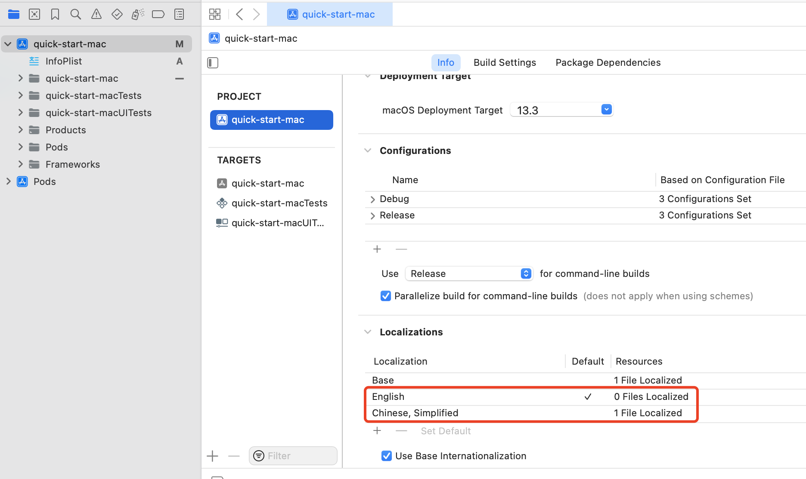
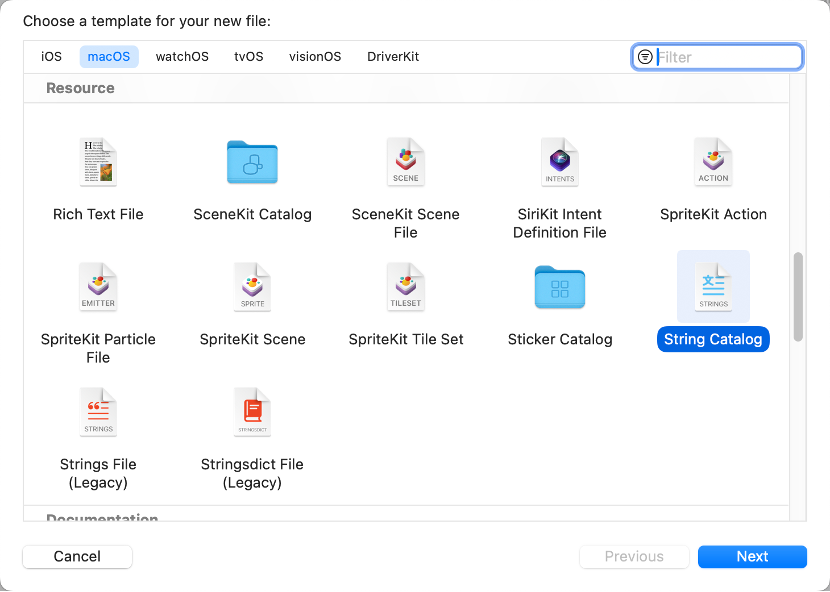
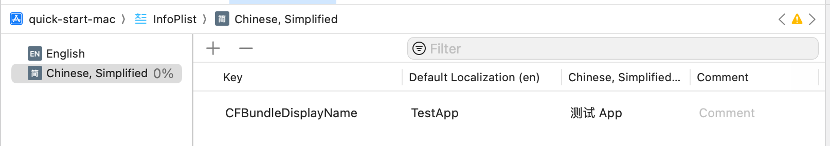
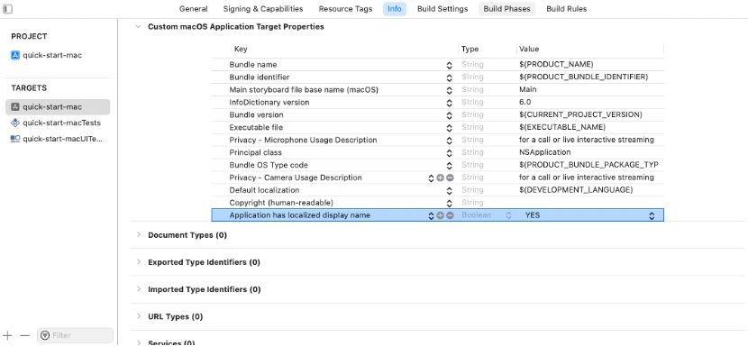

When developing on macOS 15 Beta system, if the path of the App and the App name contain non-English characters (for example, Chinese, Japanese, Korean, or others), the compiled `Metal shader library` may not contain any methods, causing the App to fail to run normally.

## Cause of the problem

This issue is cause by a system bug.

## Solution

This section takes the Chinese environment as an example to introduce how to create an `InfoPlist` file that supports multiple languages and define the name text displayed by the App. The specific steps are as follows:

1. Create files for multi-language support:

    1. Open your project in Xcode and select the **Info** tab.

    1. In the **Localizations** section, click the **+** button and select **Chinese, Simplified** to localize your project to support Chinese characters.

    

1. Create the `InfoPlist` file:

    1. Add a new file:
        1. Right-click your project folder in the project navigator and select **New File...**.
        1. In the pop-up dialog box, select **String Catalog**.
    

    1. Name the file `InfoPlist` and click **Create**.

    1. Set the language

        1. Select the `InfoPlist` file you just created in the project navigator, select the **Chinese, Simplified** language you have added, and click the **+** button.
        1. Add `Key` as `CFBundleDisplayName` and add the display name for it in the Chinese environment.

        <Admonition type="caution" title="Note">
        If the original **Info** in your project is in Chinese, you need to set the display name in English at the same time to ensure that the names displayed in the **Default Localization (zh-Hans)** and **English (en)** fields are as expected.
        </Admonition>

        

1. Define the localized display name of the App:

    1. Select the target file in **TARGETS** and open the **Info** tab.

    1. Click the **+** button and add `Key` as `Application has localized display name`. Set `Value` to `YES` so that the display name of the App can be displayed as different text in different language environments.

        

1. Verify the results:

    1. Make sure that no file names and App build paths in the project contain Chinese characters.
    1. Compile the project and build the App.
    1. Switch the language in **System Preferences** on the macOS system to ensure that the App name is displayed correctly in different languages.