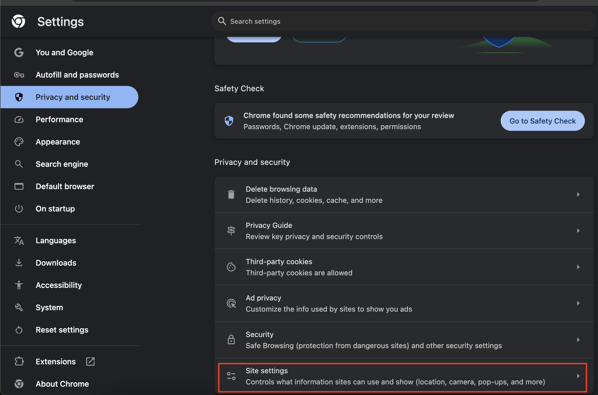
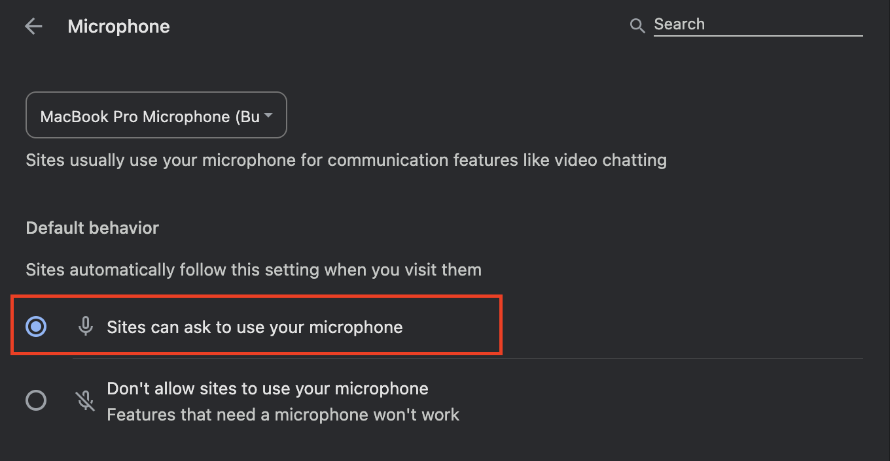
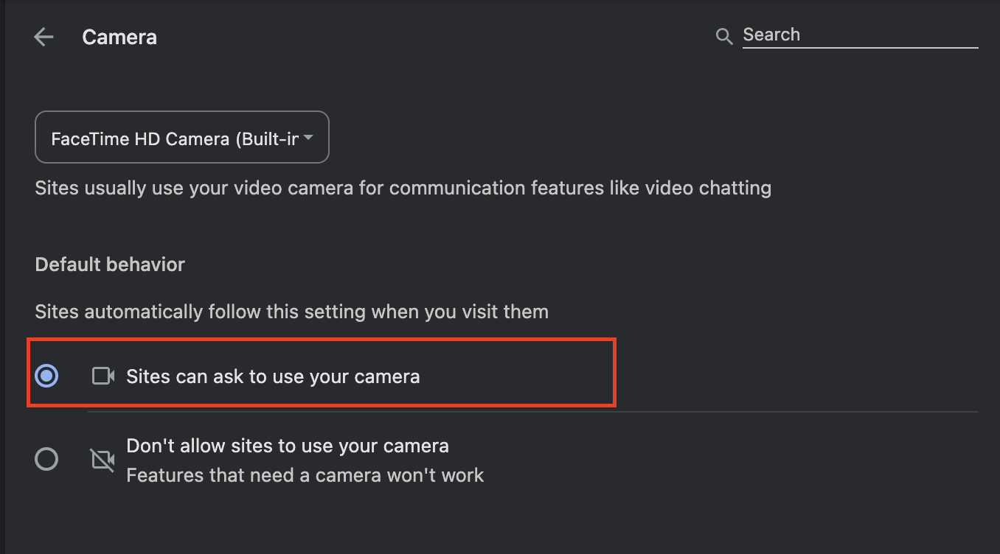
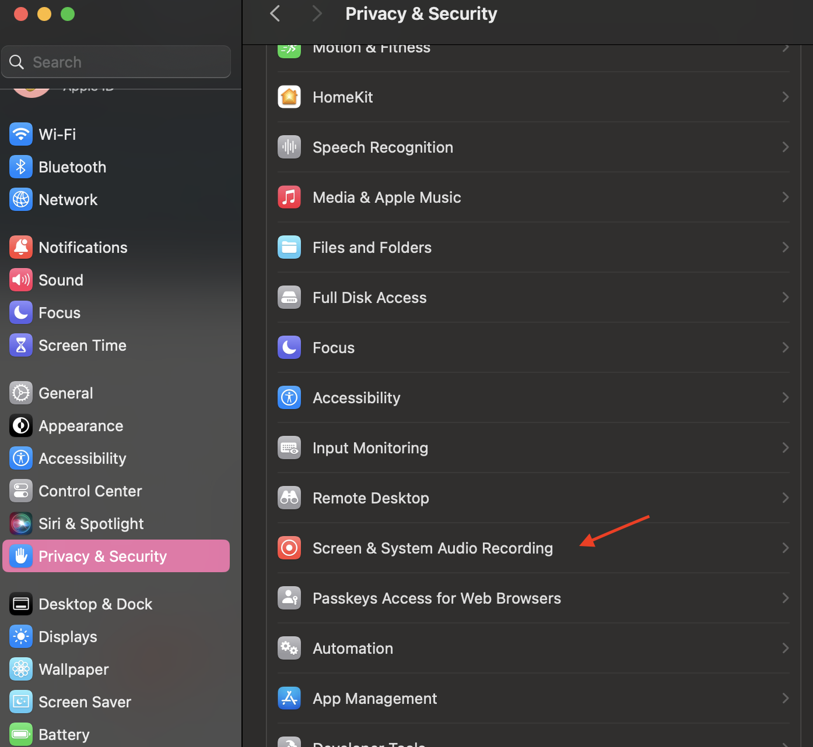
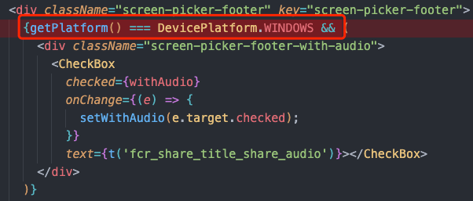
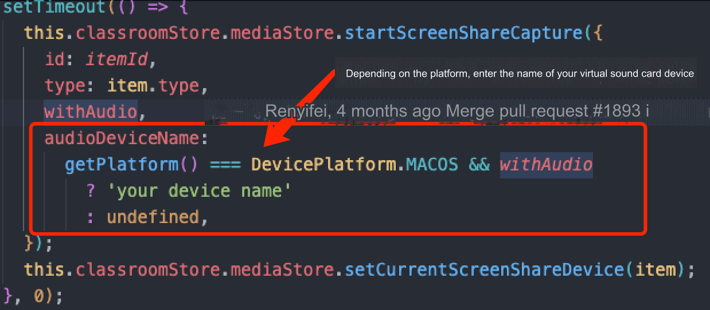

### Why can't I turn on the camera or microphone in the web client?

Check your browser's permission to use your camera and microphone. 

1. Go to the browser settings page, select **Privacy and security** > **Site settings**:

    

1. Click **Microphone** and select **Sites can ask to use your microphone**:

    

1. Click **Camera** and select **Sites can ask to use your camera**:

    


If the permissions are granted but the camera or microphone still does not work, take the following steps:

1. Clear your browser cache
1. Restart the browser
1. Update your browser

### What if my deployed domain lacks audio and video permissions, and the microphone and camera are disabled?

<Vg k="VSDK"/>, based on WebRTC, requires an HTTPS environment for security. If your domain uses HTTP, the browser blocks access to audio and video devices. Configure your domain name to HTTPS.


### How to adjust the video resolution?

#### Video resolution in a classroom

Use `launchOption.MediaOptions` configurations of the web client to adjust the resolution in a classroom:

- To adjust the small stream resolution use: `launchOption.MediaOptions.lowStreamCameraEncoderConfiguration`.
- To adjust the large stream resolution use: `launchOption.mediaOptions.cameraEncoderConfiguration`.
- To adjust the screen sharing resolution use: `launchOption.mediaOptions.screenShareEncoderConfiguration`.

The following sample code illustrates how to modify the resolution of small and large streams:

``` typescript
AgoraEduSDK.launch(appRef.current, {
    ...launchOption,
    recordUrl,
    courseWareList,
    uiMode: homeStore.theme,
    virtualBackgroundImages,
    virtualBackgroundVideos,
    mediaOptions: {
        cameraEncoderConfiguration: {
            width: 1280,
            height: 720,
            frameRate: 30,
            bitrate: 1710,
        },
        lowStreamCameraEncoderConfiguration: {
            width: 1280,
            height: 720,
            frameRate: 30,
            bitrate: 1710,
        }
    },
    listener: (evt: AgoraEduClassroomEvent, type) => {
        // Add logic for handling events here
    }
});
```

#### Recording video resolution

Adjust the resolution of class recordings in the web client by changing the `webRecordConfig` in the [Set recording state](/flexible-classroom/restful-api/classroom-api#set-the-recording-state) RESTful API:

```typescript
get recordArgs() {
    const { recordUrl, rteEngineConfig, recordRetryTimeout } = EduClassroomConfig.shared;
    const args = {
        webRecordConfig: {
            rootUrl: `${recordUrl}?language=${rteEngineConfig.language}`,
            videoBitrate: 3000,
            videoWidth: 1280,
            videoHeight: 720,
            videoFps: 15
        },
        mode: RecordMode.Web,
        retryTimeout: recordRetryTimeout,
    };
    return args;
}
```

### When using screen sharing, the error 'Please enable screen recording permission first' is reported.

If you encounter this error when you enable screen sharing, it means that you have not granted the screen recording permission.

Taking the macOS platform as an example, you can enable the corresponding permission in **System Settings** > **Privacy and Security** > **Screen & System Audio Recording**.



### How do I enable screen sharing when the Flexible classroom is embedded using an iframe?

If screen sharing is disabled after embedding the Flexible classroom in a page with an iframe, add the `display-capture` parameter to the iframe’s `allow` attribute, as follows:

```html
<iframe
  src="“xxxxxxx”"
  width="100%"
  height="100%"
  frameborder="0"
  scrolling="no"
  allowfullscreen="allowfullscreen"
  allow="display-capture; geolocation; microphone; camera; midi; encrypted-media;"
  referrerpolicy="no-referrer"
></iframe>
```

### Are there any specific network bandwidth requirements for live streaming?

- Teacher's device: Exclusive broadband and uplink speed of at least 10 Mbps and 4 Mbps, respectively.
- Student's device: Exclusive broadband of at least 4 Mbps.

## How do I troubleshoot frequent freezing, unclear audio, blank or black screens, or failed courseware loading?

If you experience these network issues, try the following steps to improve your connection:

- Restart your router and reconnect to the network.
- Move your device closer to the router, ensuring there are no walls or obstructions in between.
- Disconnect other devices or applications that may be using bandwidth, such as download programs, streaming services, cloud storage applications, or networked TV boxes.
- Switch to a different network, such as a 4G hotspot, and re-enter the classroom.
- Restart your device.
- Disable any VPNs or network proxies.

## What if the students can't hear the teacher's voice?

- Check whether the teacher's microphone is turned on.
- Check the student network status.
- Check that the student speakers, including volume mixer and browser, are muted.
- Check whether the speaker device used in the student class is selected correctly.
- Exit and re-enter the classroom or restart the device.

## What if the teacher cannot hear the students?

- Check that the students are on stage and have their microphone turned on.
- Check that the teacher's speakers, including the volume mixer and browser, are muted.
- Check whether the teacher's speaker device is selected correctly.
- Exit and re-enter the classroom or restart the device.

## How to Enable Screen Sharing with Sound

### Web

Screen sharing with sound is supported on Chrome version 74 and later on Windows and macOS, with the following limitations:

- **Windows**: Audio sharing is supported when sharing the entire screen or a Chrome tab. However, it is not supported when sharing an application window.
- **macOS**: Audio sharing is only supported when sharing a selected Chrome tab.

To enable sound, set `withAudio` to `true` in Flexible Classroom, and select the **Share audio** checkbox in the screen-sharing pop-up dialog.

### Electron

The Electron client supports sharing system sound on Windows platforms.

- **macOS**: To share system sound, a virtual sound card is required. If a user is using a virtual sound card, such as Soundflower, specify the virtual sound card name "soundflower" as a parameter. The SDK locates the corresponding virtual sound card device and starts capturing.

<Admonition type="caution" title="Note">
The default macOS sound card does not support sound capture. To enable sound sharing, the application must use a virtual sound card and pass the virtual sound card name as `deviceName` to the SDK. Agora has tested and recommends Soundflower as a virtual sound card.
</Admonition>

On macOS, the **screen sharing with sound** feature is disabled by default in the Flexible Classroom source code. To enable this feature for versions 2.8.21 and above, modify the source code as follows:

1. **Display screen sharing with sound option in the UI**

   Code path: `packages/agora-classroom-sdk/src/infra/capabilities/containers/dialog/screen-picker/index.tsx`

   Example:

   

2. **Specify the virtual sound card name on macOS**

   Code path: `packages/agora-classroom-sdk/src/infra/stores/common/toolbar/index.ts`

   Example:

   
