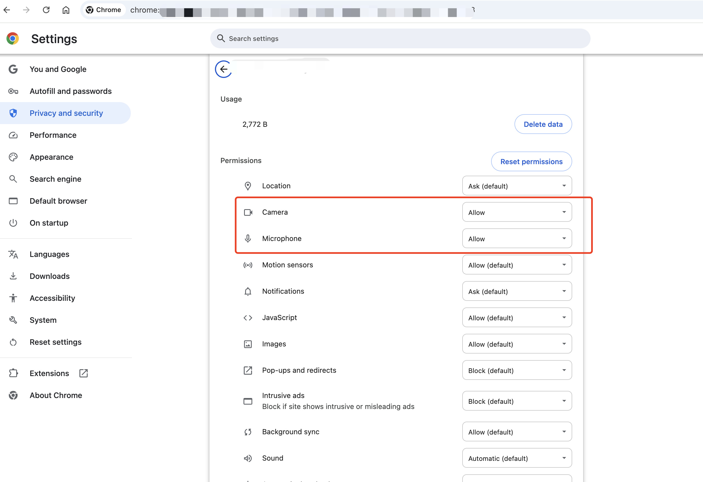

### Why can't I turn on the camera or microphone in the web client?

Check your browser's permission to use your camera and microphone.

1. Go to the browser settings page and select **Privacy and Security** > **Site Settings**:

    

1. Click on the camera and mike permissions:

    

1. Choose **Allow** in the dropdown:

    

If the permissions are granted but the camera or microphone still
don't work, take the following steps:

1. Clear your browser cache
1. Restart the browser
1. Update your browser

### What if the domain I deployed does not have audio and video permissions, is displayed as disabled, or cannot use the microphone and camera?

Audio and video devices can be disabled, as shown below:

    

    

For security reasons, WebRTC is only allowed to be used in an HTTPS environment; otherwise, the browser will not allow the page to access audio or video devices. Configure your domain name to use HTTPS.

### How to adjust the video resolution?

#### Video resolution in a classroom

Use `launchOption.MediaOptions` configurations of the web client to adjust the resolution in a classroom:

- To adjust the small stream resolution use: `launchOption.MediaOptions.lowStreamCameraEncoderConfiguration`.
- To adjust the large stream resolution use: `launchOption.mediaOptions.cameraEncoderConfiguration`.
- To adjust the screen sharing resolution use: `launchOption.mediaOptions.screenShareEncoderConfiguration`.

The following sample code illustrates how to modify the resolution of small and large streams:

``` typescript
AgoraEduSDK.launch(appRef.current, {
    ...launchOption,
    recordUrl,
    courseWareList,
    uiMode: homeStore.theme,
    virtualBackgroundImages,
    virtualBackgroundVideos,
    mediaOptions: {
        cameraEncoderConfiguration: {
            width: 1280,
            height: 720,
            frameRate: 30,
            bitrate: 1710,
        },
        lowStreamCameraEncoderConfiguration: {
            width: 1280,
            height: 720,
            frameRate: 30,
            bitrate: 1710,
        }
    },
    listener: (evt: AgoraEduClassroomEvent, type) => {
        // Add logic for handling events here
    }
});
```

#### Recording video resolution

Adjust the resolution of class recordings in the web client by changing the `webRecordConfig` in the [Set recording state](/flexible-classroom/restful-api/classroom-api#set-the-recording-state) RESTful API:

```typescript
get recordArgs() {
    const { recordUrl, rteEngineConfig, recordRetryTimeout } = EduClassroomConfig.shared;
    const args = {
        webRecordConfig: {
            rootUrl: `${recordUrl}?language=${rteEngineConfig.language}`,
            videoBitrate: 3000,
            videoWidth: 1280,
            videoHeight: 720,
            videoFps: 15
        },
        mode: RecordMode.Web,
        retryTimeout: recordRetryTimeout,
    };
    return args;
}
```

### When using screen sharing, the error 'Please enable screen recording permission first' is reported.

If you encounter this error when you enable screen sharing, it means that you have not granted the screen recording permission.

Taking the macOS system as an example, you can enable the corresponding permission in **System Settings** > **Privacy and Security** > **Screen & System Audio Recording**.

    

Enable screen recording permission for AgoraFlexibleClassroom:

    

### What if the screen sharing feature is invalid after embedding Flexible Classroom with iframe?

You can use the iframe `allow` attribute to add `display-capture` parameters for screen sharing. The code example is as follows:

```html
<iframe
  src="“xxxxxxx”"
  width="100%"
  height="100%"
  frameborder="0"
  scrolling="no"
  allowfullscreen="allowfullscreen"
  allow="display-capture; geolocation; microphone; camera; midi; encrypted-media;"
  referrerpolicy="no-referrer"
></iframe>
```

### Are there any specific network bandwidth requirements for live streaming?

- Teacher's device: Exclusive broadband and uplink speed of at least 10 Mbps and 4 Mbps, respectively.
- Student's device: Exclusive broadband of at least 4 Mbps.

## How do I troubleshoot frequent freezing, unclear audio, blank or black screens, or failed courseware loading?

If you experience these network issues, try the following steps to improve your connection:

- Restart your router and reconnect to the network.
- Move your device closer to the router, ensuring there are no walls or obstructions in between.
- Disconnect other devices or applications that may be using bandwidth, such as download programs, streaming services, cloud storage applications, or networked TV boxes.
- Switch to a different network, such as a 4G hotspot, and re-enter the classroom.
- Restart your device.
- Disable any VPNs or network proxies.

## What if the students can't hear the teacher's voice?

- Check whether the teacher's microphone is turned on.
- Check the student network status.
- Check that the student speakers, including volume mixer and browser, are muted.
- Check whether the speaker device used in the student class is selected correctly.
- Exit and re-enter the classroom or restart the device.

## What if the teacher cannot hear the students?

- Check that the students are on stage and have their microphone turned on.
- Check that the teacher's speakers, including the volume mixer and browser, are muted.
- Check whether the teacher's speaker device is selected correctly.
- Exit and re-enter the classroom or restart the device.

## How to enable screen sharing with audio?

### Web

Web screen sharing is only supported in Chrome version 74 and above on Windows and macOS, including the following:

- Windows supports audio sharing when sharing the entire screen or a Chrome tab, but not when sharing an app window.
- macOS supports sharing audio when sharing a Chrome tab. After setting `withAudio` to `true`, check the share audio box in the screen sharing pop-up.

### Electron

The Electron terminal supports sharing system audio on Windows.

On macOS, use a virtual sound card to capture and share system sounds. If the user uses a virtual sound card, such as Soundflower, you can pass its name (`"soundflower"`) as a parameter. The SDK will find the corresponding virtual sound card device and start capturing.

<Admonition type="info" title="Note">The default sound card on macOS does not support capture. To enable this feature, the app needs to enable a virtual sound card and pass its name (`deviceName`) to the SDK. Agora has tested and recommends Soundflower as the virtual sound card.</Admonition>

On macOS, screen sharing with audio is turned off by default. For Flexible Classroom versions 2.8.21 and above, if you need to enable it, modify the source code. The specific modification steps are as follows:

1. Display screen sharing with audio at the UI level.

    Code path: `packages/agora-classroom-sdk/src/infra/capabilities/containers/dialog/screen-picker/index.tsx`

1. Pass the name of the virtual sound card on macOS.

    Code path: `packages/agora-classroom-sdk/src/infra/stores/common/toolbar/index.ts`. The code is as follows:

    

