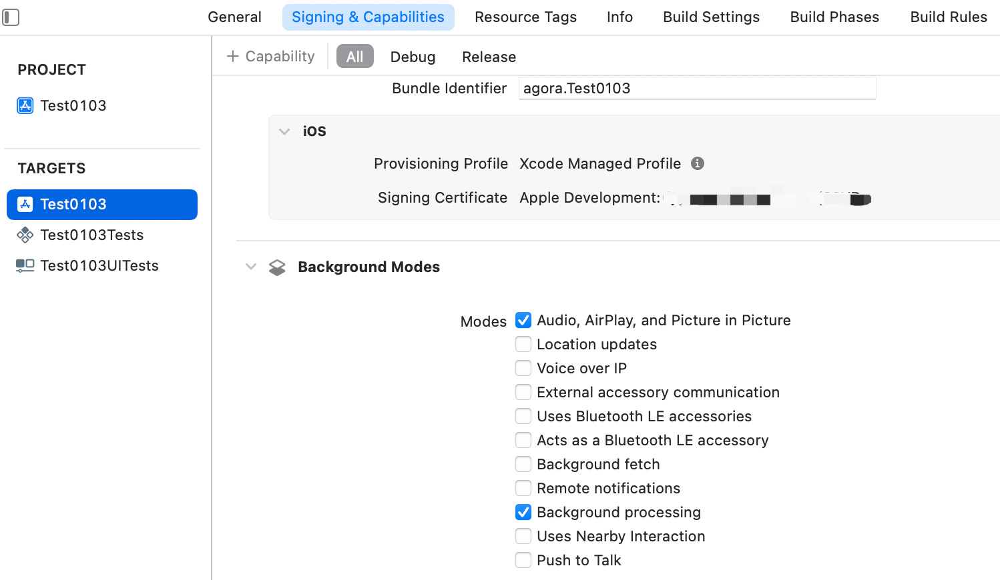

export const toc = [{}];

After locking the iOS device or switching the app to the background, the audio cannot be heard, and the video screen is stuck at the last frame before switching to the background.

## Reason

Due to iOS system limitations, starting from iOS 12.4, the system automatically stops capturing audio and video when the app goes to the background.

## Solution

When using the SDK to capture video, you cannot capture video in the background. However, you can enable the app to capture audio in the background by following these steps:

1. In Xcode's project settings, click the + symbol in **Signing & Capabilities**, add **Background Modes**, and then check **Audio, Airplay, and Picture in Picture** and **Background processing**, as shown below.

   

2. Ensure that the audio collection status is normal when the app is in the foreground:
    - The user (in communication scenarios) or host (in live broadcast scenarios) has joined the channel.
    - The `localAudioStateChanged` callback has been received, and `state` is `AgoraAudioLocalStateRecording`, indicating that the local audio capture device is in a normal state.

      <Admonition type="info" title="Information">
        Since the audio module is enabled by default, you just need to ensure that you do not call the `disableAudio` or `disableLocalAudio` method to disable audio capture.
      </Admonition>

3. Switch the app to the background and ensure audio collection returns to normal.
